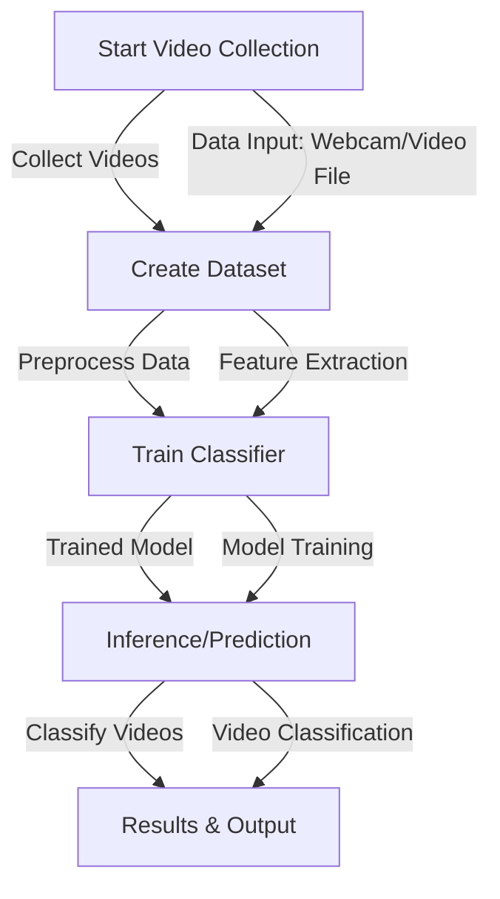

# Video-Based Classification System

This project provides a complete pipeline for **video-based classification**, from collecting videos to training, inference, and classification. The system leverages **OpenCV**, **MediaPipe**, and other libraries to handle video data, create datasets, and train classifiers for tasks such as object detection and gesture recognition.

## Project Structure

```plaintext
├── classification.py          # Code for classifying video data using trained models
├── collect_vids.py             # Script for video data collection and storage
├── create_dataset.py           # Script to preprocess collected videos into usable datasets
├── inference_classifier.py     # Code for making predictions using the trained classifier
├── train_classifier.py         # Training script for building classification models
```

## Workflow Overview



## Codebase Overview

1. **`collect_vids.py`**  
   This script handles **video collection** using OpenCV. It captures video frames from a camera and stores them in a structured directory format, suitable for classification tasks.

   - **Usage**: `python collect_vids.py`
   - Collects video data for different classes and stores them in folders for training.

2. **`create_dataset.py`**  
   This script preprocesses the collected video data, creating a usable dataset for training the model. It might involve resizing frames, normalizing, or extracting features.

   - **Usage**: `python create_dataset.py`
   - Prepares the dataset for training and testing.

3. **`train_classifier.py`**  
   This script trains a classifier model using the prepared dataset. It supports various machine learning models (e.g., SVM, neural networks) for training video classifiers.

   - **Usage**: `python train_classifier.py`
   - Implements training routines and saves the trained model.

4. **`inference_classifier.py`**  
   This script allows users to run inference on new video data using the trained model. It takes video input and predicts the corresponding class label.

   - **Usage**: `python inference_classifier.py`
   - Classifies videos using the trained model.

5. **`classification.py`**  
   This script acts as a core module for video classification tasks. It ties the collection, dataset creation, training, and inference scripts together.

   - **Usage**: `python classification.py`
   - Main module to classify video data using the pipeline.

## Diagram of Code Flow


## Requirements

Make sure to install the required libraries:

```bash
pip install opencv-python mediapipe simpleaudio
```

## How to Run

1. **Collect Video Data**:  
   Run the video collection script to gather videos for different classes.

   ```bash
   python collect_vids.py
   ```

2. **Create Dataset**:  
   Preprocess the collected videos to create a structured dataset.

   ```bash
   python create_dataset.py
   ```

3. **Train Classifier**:  
   Train the model on the prepared dataset.

   ```bash
   python train_classifier.py
   ```

4. **Run Inference**:  
   Use the trained classifier to make predictions on new video data.

   ```bash
   python inference_classifier.py
   ```

## Future Work

- Add support for real-time video classification.
- Implement more advanced models (e.g., deep learning-based).
- Improve dataset preprocessing for better accuracy.
